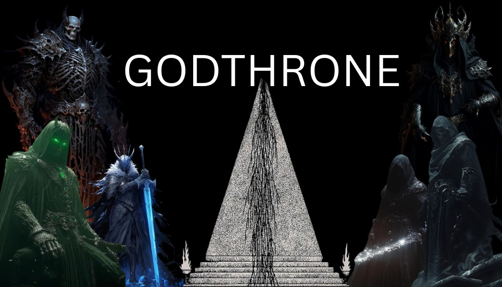
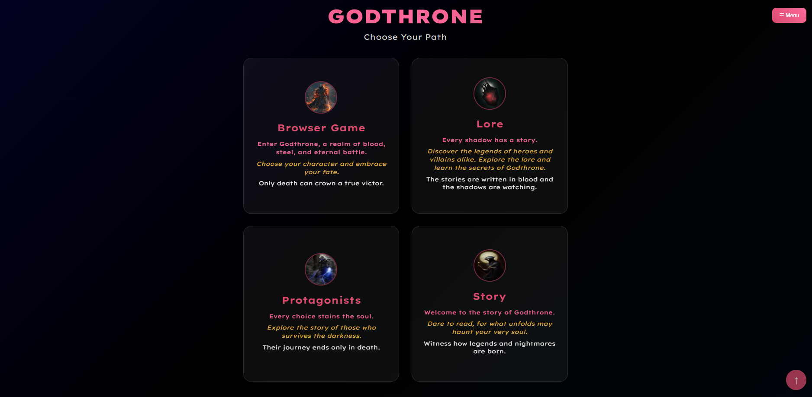
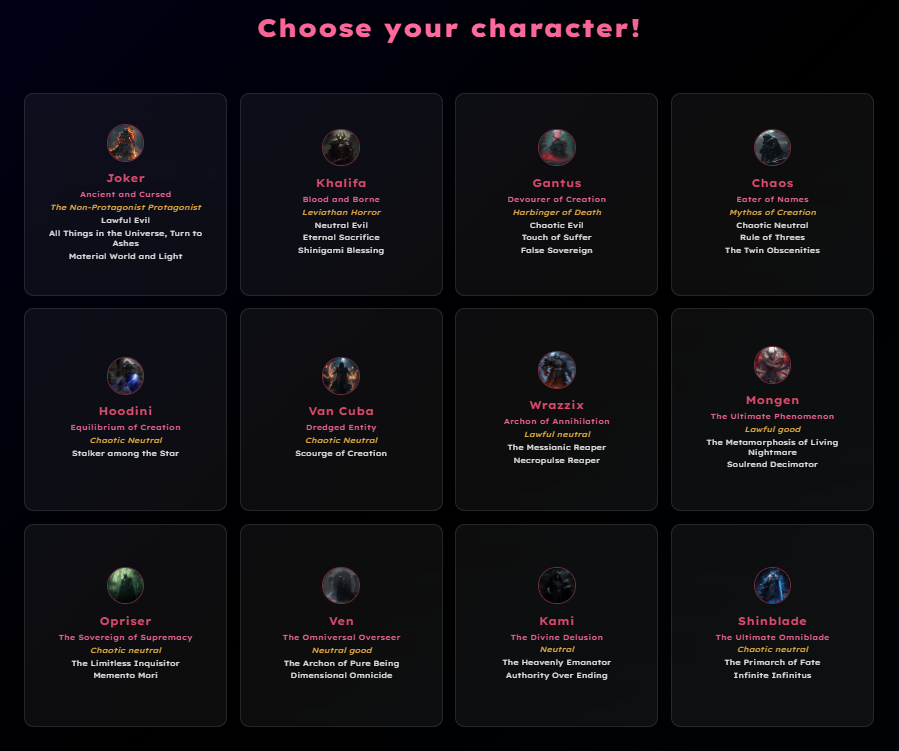
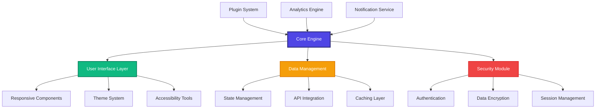

# ⚡ Godthrone



**Godthrone** is an ambitious next-generation project that pushes the boundaries of interactive experiences. Built with cutting-edge technology and innovative design principles, Godthrone represents the future of immersive digital environments.





---

## 📚 Table of Contents

- [⚡ Godthrone](#-godthrone)
  - [📚 Table of Contents](#-table-of-contents)
  - [🌟 Project Vision](#-project-vision)
  - [🏗️ System Architecture](#️-system-architecture)
  - [✨ Planned Features](#-planned-features)
    - [🎯 Core Experience](#-core-experience)
    - [🔧 Technical Excellence](#-technical-excellence)
    - [🌐 Community Features](#-community-features)
  - [💻 Development Setup](#-development-setup)
    - [⚙️ Prerequisites](#️-prerequisites)
    - [🚀 Installation \& Setup](#-installation--setup)
    - [🔨 Development Commands](#-development-commands)
  - [🗂️ Project Structure](#️-project-structure)
  - [📊 Development Status](#-development-status)
  - [🤝 Contributing](#-contributing)
    - [🔧 Development Guidelines](#-development-guidelines)
    - [📝 How to Contribute](#-how-to-contribute)
    - [🐛 Bug Reports](#-bug-reports)
    - [💡 Feature Requests](#-feature-requests)
  - [📄 License](#-license)
  - [🌟 Join the Revolution](#-join-the-revolution)

---

## 🌟 Project Vision

Godthrone is currently in active development, representing a groundbreaking approach to digital interaction and user experience. Our vision encompasses:

- **🚀 Innovation First**: Leveraging the latest technologies to create unprecedented experiences
- **🎨 Design Excellence**: Crafting beautiful, intuitive interfaces that delight users
- **⚡ Performance Optimized**: Ensuring lightning-fast performance across all platforms
- **🌍 Global Accessibility**: Building inclusive experiences for users worldwide


*Early development preview - UI and features are subject to change*

---

## 🏗️ System Architecture

The following diagram illustrates Godthrone's planned modular architecture:



---

## ✨ Planned Features

### 🎯 Core Experience
- **🎨 Modern UI/UX**: Sleek, responsive design with smooth animations and transitions
- **⚡ Real-time Processing**: Lightning-fast data processing and user interactions
- **🔄 Seamless Synchronization**: Cross-device data sync with conflict resolution
- **🎮 Interactive Elements**: Engaging, gamified user interactions
- **📱 Multi-platform Support**: Native performance on web, mobile, and desktop

### 🔧 Technical Excellence
- **🏗️ Modular Architecture**: Scalable, maintainable codebase with clear separation of concerns
- **🔒 Enterprise Security**: Bank-level encryption and security protocols
- **📊 Advanced Analytics**: Comprehensive user behavior insights and performance monitoring
- **🚀 Edge Computing**: Optimized content delivery and reduced latency
- **♿ Accessibility First**: WCAG 2.1 AA compliance and inclusive design principles

### 🌐 Community Features
- **👥 Collaboration Tools**: Real-time collaborative features for team workflows
- **💬 Communication Hub**: Integrated messaging and notification systems
- **🎯 Personalization**: AI-powered recommendations and customizable experiences
- **🌍 Internationalization**: Multi-language support with RTL text compatibility
- **📈 Progress Tracking**: Detailed analytics and achievement systems

---

## 💻 Development Setup

### ⚙️ Prerequisites

Ensure you have the following installed on your development machine:

- **Node.js** (v18.0 or higher) - [Download here](https://nodejs.org/)
- **Git** (v2.30 or higher) - [Download here](https://git-scm.com/)
- **Modern IDE** - VS Code, WebStorm, or similar
- **Modern Browser** - Chrome 90+, Firefox 88+, Safari 14+

Optional but recommended:
- **Docker** (v20.0 or higher) for containerized development
- **Yarn** package manager for faster dependency installation

### 🚀 Installation & Setup

1. **Clone the repository:**
   ```bash
   git clone https://github.com/your-username/Godthrone.git
   cd Godthrone
   ```

2. **Install dependencies:**
   ```bash
   npm install
   # or for faster installation
   yarn install
   ```

3. **Configure environment:**
   ```bash
   cp .env.example .env.local
   # Edit .env.local with your configuration
   ```

4. **Initialize the database (if applicable):**
   ```bash
   npm run db:setup
   ```

### 🔨 Development Commands

```bash
# Start development server
npm run dev

# Run tests
npm run test
npm run test:watch    # Watch mode
npm run test:coverage # With coverage

# Build for production
npm run build

# Preview production build
npm run preview

# Linting and formatting
npm run lint
npm run lint:fix
npm run format

# Database operations
npm run db:migrate
npm run db:seed
npm run db:reset
```

---

## 🗂️ Project Structure

```
Godthrone/
├── 📁 src/
│   ├── 📁 components/      # Reusable UI components
│   ├── 📁 pages/           # Application pages/views
│   ├── 📁 services/        # API and business logic
│   ├── 📁 hooks/           # Custom React hooks (if applicable)
│   ├── 📁 utils/           # Utility functions and helpers
│   ├── 📁 types/           # TypeScript type definitions
│   ├── 📁 styles/          # Global styles and themes
│   └── 📄 main.tsx         # Application entry point
├── 📁 public/
│   ├── 📁 assets/          # Static assets (images, icons)
│   └── 📁 locales/         # Internationalization files
├── 📁 docs/
│   ├── 📄 API.md           # API documentation
│   ├── 📄 ARCHITECTURE.md  # System architecture guide
│   └── 📄 DEPLOYMENT.md    # Deployment instructions
├── 📁 tests/
│   ├── 📁 unit/            # Unit tests
│   ├── 📁 integration/     # Integration tests
│   └── 📁 e2e/             # End-to-end tests
├── 📁 scripts/             # Build and deployment scripts
├── 📄 package.json         # Project dependencies and scripts
├── 📄 tsconfig.json        # TypeScript configuration
├── 📄 vite.config.ts       # Build tool configuration
├── 📄 docker-compose.yml   # Docker development environment
└── 📄 README.md           # This file
```

---

## 📊 Development Status

| Component | Status | Progress | Notes |
|-----------|--------|----------|-------|
| 🏗️ Core Architecture | 🟡 In Progress | 60% | Foundation laid, optimization ongoing |
| 🎨 UI Framework | 🟡 In Progress | 45% | Design system established |
| 🔒 Security Layer | 🔴 Planning | 15% | Research phase, implementation pending |
| 📱 Mobile Support | 🔴 Planning | 10% | Responsive design in progress |
| 🧪 Testing Suite | 🟡 In Progress | 35% | Unit tests implemented |
| 📚 Documentation | 🟡 In Progress | 40% | API docs and guides |
| 🚀 Performance | 🔴 Planning | 20% | Profiling and optimization planned |

**Legend:** 🟢 Complete | 🟡 In Progress | 🔴 Planning | ⚫ Blocked

---


## 🤝 Contributing

We welcome contributions from developers of all skill levels! Here's how you can get involved:

### 🔧 Development Guidelines
- Follow our [Code Style Guide](docs/CODE_STYLE.md)
- Write tests for all new features
- Ensure accessibility compliance
- Update documentation for any changes

### 📝 How to Contribute
1. Fork the repository
2. Create a feature branch (`git checkout -b feature/amazing-feature`)
3. Make your changes and add tests
4. Commit your changes (`git commit -m 'Add amazing feature'`)
5. Push to your branch (`git push origin feature/amazing-feature`)
6. Open a Pull Request

### 🐛 Bug Reports
Use our [Issue Template](.github/ISSUE_TEMPLATE.md) to report bugs with:
- Clear description of the problem
- Steps to reproduce
- Expected vs actual behavior
- Environment details (OS, browser, version)

### 💡 Feature Requests
We love hearing your ideas! Submit feature requests with:
- Clear use case description
- Expected functionality
- Potential implementation approach
- Impact assessment

---

## 📄 License

This project is licensed under the MIT License - see the [LICENSE](LICENSE) file for details.

---

<div align="center">

## 🌟 Join the Revolution

**Godthrone** is more than a project—it's a vision of what's possible when innovation meets excellence.

[](https://github.com/your-username/Godthrone)
[](https://github.com/your-username/Godthrone/releases)
[](https://discord.gg/your-invite)

[🚀 Get Started](#-installation--setup) | [📖 Documentation](docs/) | [💬 Community](https://github.com/your-username/Godthrone/discussions) | [🐛 Report Issues](https://github.com/your-username/Godthrone/issues)

**⭐ Star this repository to follow our journey! ⭐**

</div>